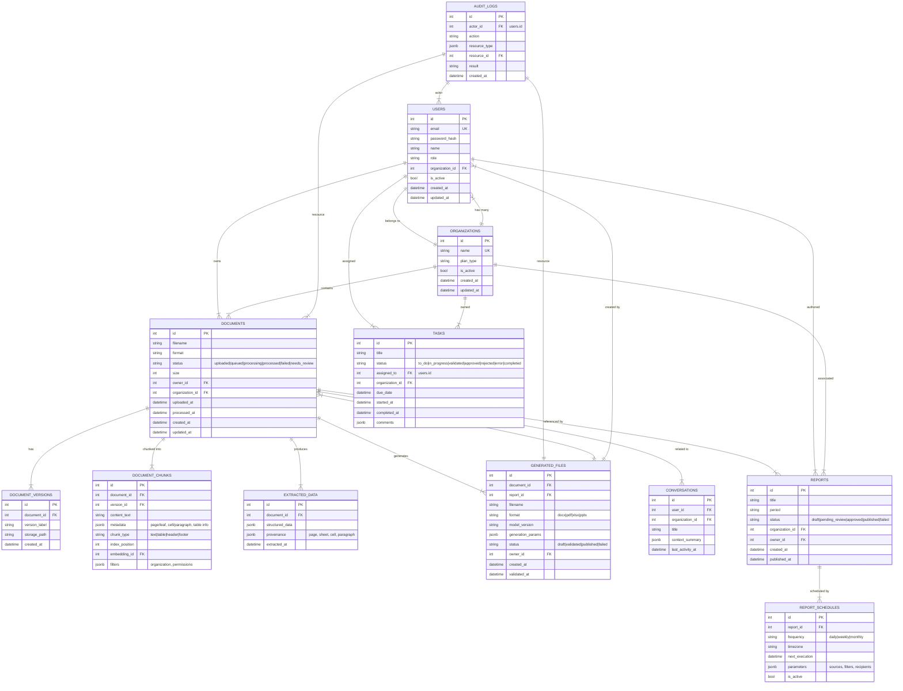

# SmartWork AI MVP - Entity Relationship Diagram

```mermaid
erDiagram
    USERS ||--|| ORGANIZATIONS : "belongs to"
    ORGANIZATIONS ||--|{ USERS : "has many"
    USERS ||--|{ DOCUMENTS : "owns"
    ORGANIZATIONS ||--|{ DOCUMENTS : "contains"
    DOCUMENTS ||--|{ DOCUMENT_VERSIONS : "has"
    DOCUMENTS ||--|{ DOCUMENT_CHUNKS : "chunked into"
    DOCUMENTS ||--|{ EXTRACTED_DATA : "produces"
    DOCUMENTS ||--|{ GENERATED_FILES : "generates"
    DOCUMENTS ||--|{ CONVERSATIONS : "related to"
    DOCUMENTS ||--|{ REPORTS : "referenced by"
    USERS ||--|{ REPORTS : "authored"
    USERS ||--|{ TASKS : "assigned"
    ORGANIZATIONS ||--|{ REPORTS : "associated"
    ORGANIZATIONS ||--|{ TASKS : "owned"
    REPORTS ||--|{ REPORT_SCHEDULES : "scheduled by"
    GENERATED_FILES ||--|{ DOCUMENTS : "based on"
    GENERATED_FILES ||--|{ USERS : "created by"
    AUDIT_LOGS ||--|{ USERS : "actor"
    AUDIT_LOGS ||--|{ DOCUMENTS : "resource"
    AUDIT_LOGS ||--|| GENERATED_FILES : "resource"

    USERS {
        int id PK
        string email UK
        string password_hash
        string name
        string role
        int organization_id FK
        bool is_active
        datetime created_at
        datetime updated_at
    }

    ORGANIZATIONS {
        int id PK
        string name UK
        string plan_type
        bool is_active
        datetime created_at
        datetime updated_at
    }

    DOCUMENTS {
        int id PK
        string filename
        string format
        string status "uploaded|queued|processing|processed|failed|needs_review"
        int size
        int owner_id FK
        int organization_id FK
        datetime uploaded_at
        datetime processed_at
        datetime created_at
        datetime updated_at
    }

    DOCUMENT_VERSIONS {
        int id PK
        int document_id FK
        string version_label
        string storage_path
        datetime created_at
    }

    DOCUMENT_CHUNKS {
        int id PK
        int document_id FK
        int version_id FK
        string content_text
        jsonb metadata "page/leaf, cell/paragraph, table info"
        string chunk_type "text|table|header|footer"
        int index_position
        int embedding_id FK
        jsonb filters "organization, permissions"
    }

    EXTRACTED_DATA {
        int id PK
        int document_id FK
        jsonb structured_data
        jsonb provenance "page, sheet, cell, paragraph"
        datetime extracted_at
    }

    CONVERSATIONS {
        int id PK
        int user_id FK
        int organization_id FK
        string title
        jsonb context_summary
        datetime last_activity_at
    }

    GENERATED_FILES {
        int id PK
        int document_id FK
        int report_id FK
        string filename
        string format "docx|pdf|xlsx|pptx"
        string model_version
        jsonb generation_params
        string status "draft|validated|published|failed"
        int owner_id FK
        datetime created_at
        datetime validated_at
    }

    REPORTS {
        int id PK
        string title
        string period
        string status "draft|pending_review|approved|published|failed"
        int organization_id FK
        int owner_id FK
        datetime created_at
        datetime published_at
    }

    REPORT_SCHEDULES {
        int id PK
        int report_id FK
        string frequency "daily|weekly|monthly"
        string timezone
        datetime next_execution
        jsonb parameters "sources, filters, recipients"
        bool is_active
    }

    TASKS {
        int id PK
        string title
        string status "to_do|in_progress|validated|approved|rejected|error|completed"
        int assigned_to FK "users.id"
        int organization_id FK
        datetime due_date
        datetime started_at
        datetime completed_at
        jsonb comments
    }

    AUDIT_LOGS {
        int id PK
        int actor_id FK "users.id"
        string action
        jsonb resource_type
        int resource_id FK
        string result
        datetime created_at
    }
```